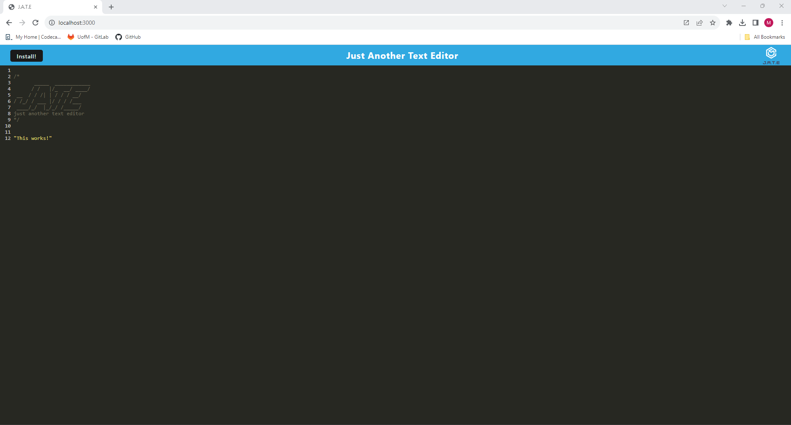
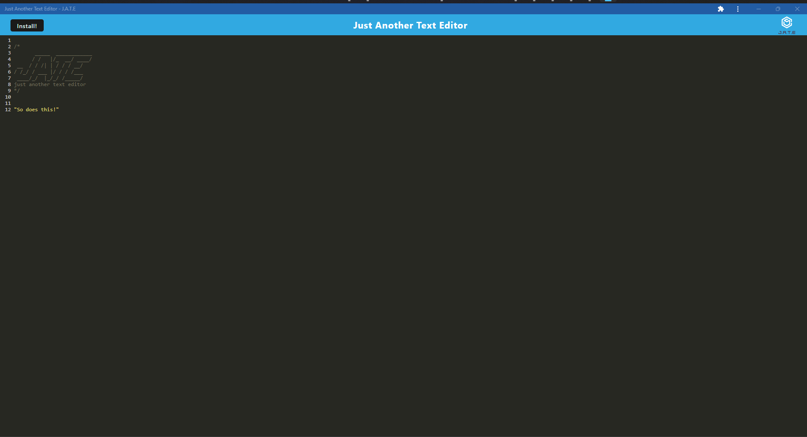

# PWA Text Editor Challenge	
## Description
This project was meant to show how a PWA can be developed and configured so that users can still access the app even when they are unable to get an internet connection.
## Table of Contents
- [Installation](#installation)
- [Usage](#usage)
- [Credits](#credits)
- [License](#license)
- [Questions](#questions)
- [Tests](#tests)
## Installation
The pertinent files for the project, including this README can all be found in the Github repository located at: https://github.com/mhalder4/pwa-text-editor-challenge. The website can be found at the Github pages address that follows: https://pwa-text-editor-challenge-mlh-414eca18a36a.herokuapp.com/. The user can also hit the install button in the upper left of the browser tab in order to install an offline version for use
## Usage
The program is a normal text editor that can be accessed either normally online, or can be installed to access and use just the same offline. Screenshots of both online and offline forms are shown below.

Online

Offline

## Credits
A more structured version with clearer To-Do statements and some additional guided help was given to me and the rest of my cohort by our instructor, Gary Almes. The GitHub repo he gave us access to can be found here: https://github.com/galmes2u/pwa-homework-helper.
## License
[MIT License](https://choosealicense.com/licenses/mit/)
MIT License

Copyright (c) 2023 Matthew Halder

Permission is hereby granted, free of charge, to any person obtaining a copy
of this software and associated documentation files (the "Software"), to deal
in the Software without restriction, including without limitation the rights
to use, copy, modify, merge, publish, distribute, sublicense, and/or sell
copies of the Software, and to permit persons to whom the Software is
furnished to do so, subject to the following conditions:

The above copyright notice and this permission notice shall be included in all
copies or substantial portions of the Software.

THE SOFTWARE IS PROVIDED "AS IS", WITHOUT WARRANTY OF ANY KIND, EXPRESS OR
IMPLIED, INCLUDING BUT NOT LIMITED TO THE WARRANTIES OF MERCHANTABILITY,
FITNESS FOR A PARTICULAR PURPOSE AND NONINFRINGEMENT. IN NO EVENT SHALL THE
AUTHORS OR COPYRIGHT HOLDERS BE LIABLE FOR ANY CLAIM, DAMAGES OR OTHER
LIABILITY, WHETHER IN AN ACTION OF CONTRACT, TORT OR OTHERWISE, ARISING FROM,
OUT OF OR IN CONNECTION WITH THE SOFTWARE OR THE USE OR OTHER DEALINGS IN THE
SOFTWARE.
## Questions
Find me on [GitHub](https://github.com/mhalder4)
## Tests
N/A
